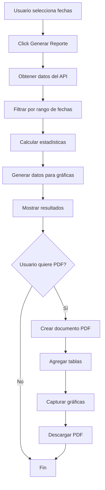

# 📊 Sistema de Reportes del Laboratorio

Sistema completo de generación de reportes con gráficas interactivas y exportación a PDF.

## 🎯 Características

### ✅ Filtros de Fecha
- Selección de fecha de inicio y fin
- Validación de rangos de fechas
- Filtrado automático de datos por período

### ✅ Estadísticas Generales
- **Total de Pacientes**: Número total de pacientes registrados
- **Total de Muestras**: Cantidad de muestras en el período seleccionado

### ✅ Gráficas Interactivas

#### 1. **Gráfica de Barras - Muestras por Tipo**
Muestra la distribución de muestras según su tipo:
- Sangre
- Orina
- Heces

#### 2. **Gráfica de Pastel - Distribución por Estado**
Visualiza el estado de las muestras:
- Pendiente
- En Proceso
- Completado

#### 3. **Gráfica de Línea - Tendencia Diaria**
Muestra la evolución de muestras día a día en el período seleccionado.

### ✅ Exportación a PDF
- Generación automática de PDF profesional
- Incluye todas las estadísticas y tablas
- Captura de gráficas en alta calidad
- Diseño con colores de la marca (Healing Greens)

## 📍 Ubicación

**Botón de Acceso:** Dashboard Admin → Acciones Rápidas → "Generar Reportes"

**Archivo del Modal:** [`app/components/ModalReportes.tsx`](file:///c:/Users/oagui/Documents/GitHub/ClinicaBlancaTrinidad/blancatrinidad/app/components/ModalReportes.tsx)

## 🚀 Cómo Usar

### Paso 1: Abrir el Modal
1. Ir al Dashboard Admin
2. Click en el botón naranja "Generar Reportes"

### Paso 2: Seleccionar Período
1. Elegir **Fecha Inicio**
2. Elegir **Fecha Fin**
3. Click en "Generar Reporte"

### Paso 3: Visualizar Resultados
- Ver estadísticas generales en tarjetas destacadas
- Analizar gráficas interactivas
- Revisar tendencias y distribuciones

### Paso 4: Exportar a PDF
1. Click en "Exportar a PDF"
2. El archivo se descargará automáticamente
3. Nombre del archivo: `Reporte_Laboratorio_[fecha_inicio]_[fecha_fin].pdf`

## 📦 Librerías Utilizadas

```json
{
  "recharts": "Gráficas interactivas (Bar, Pie, Line)",
  "jspdf": "Generación de PDF",
  "jspdf-autotable": "Tablas en PDF",
  "html2canvas": "Captura de gráficas para PDF"
}
```

## 🎨 Diseño

### Colores de Gráficas
```javascript
const COLORS = [
  '#4B9B6E', // brand-500
  '#6BBF8A', // brand-300
  '#A8D5BA', // brand-100
  '#2E7D5C', // brand-700
  '#1B5E3A'  // brand-900
];
```

### Tarjetas de Estadísticas
- **Total Pacientes**: Gradiente verde (brand-500 a brand-700)
- **Total Muestras**: Gradiente verde claro (green-500 a green-700)

## 📊 Estructura del PDF

### Página 1: Datos Tabulares
1. **Título**: "Reporte de Laboratorio"
2. **Período**: Rango de fechas seleccionado
3. **Resumen General**: Tabla con métricas clave
4. **Muestras por Tipo**: Tabla detallada
5. **Muestras por Estado**: Tabla detallada

### Página 2: Gráficas
1. **Título**: "Análisis Gráfico"
2. **Imagen**: Captura de todas las gráficas en alta calidad

## 🔧 Funciones Principales

### `obtenerReporte()`
```typescript
// Obtiene datos del backend
// Filtra por rango de fechas
// Calcula estadísticas
// Genera datos para gráficas
```

### `exportarPDF()`
```typescript
// Crea documento PDF
// Agrega tablas con jsPDF-autoTable
// Captura gráficas con html2canvas
// Descarga el archivo
```

## 📈 Datos Calculados

### Muestras por Tipo
```typescript
{
  tipo: string,      // "sangre", "orina", "heces"
  cantidad: number   // Contador de muestras
}
```

### Muestras por Estado
```typescript
{
  estado: string,    // "Pendiente", "En Proceso", "Completado"
  cantidad: number   // Contador de muestras
}
```

### Muestras por Día
```typescript
{
  fecha: string,     // "DD/MM/YYYY"
  cantidad: number   // Muestras en ese día
}
```

## ⚠️ Validaciones

### Fechas Requeridas
```typescript
if (!fechaInicio || !fechaFin) {
  showWarning('Fechas requeridas', 'Por favor selecciona fecha de inicio y fin');
}
```

### Rango Válido
```typescript
if (new Date(fechaInicio) > new Date(fechaFin)) {
  showWarning('Fechas inválidas', 'La fecha de inicio debe ser anterior a la fecha fin');
}
```

### Datos Disponibles
```typescript
if (!reportData) {
  showWarning('Sin datos', 'Primero genera el reporte');
}
```

## 🎯 Ejemplo de Uso

```typescript
// 1. Usuario abre el modal
setModalReportesAbierto(true);

// 2. Selecciona fechas
setFechaInicio('2024-01-01');
setFechaFin('2024-01-31');

// 3. Genera reporte
await obtenerReporte();
// → Muestra gráficas y estadísticas

// 4. Exporta a PDF
await exportarPDF();
// → Descarga: Reporte_Laboratorio_2024-01-01_2024-01-31.pdf
```

## 🔄 Flujo de Datos



## 📱 Responsive Design

- **Desktop**: Modal de 6xl width con scroll vertical
- **Tablet**: Grid de 1 columna para gráficas
- **Mobile**: Botones y filtros apilados verticalmente

## 🎨 Componentes UI

### Modal Header
- Icono de BarChart3
- Título "Reportes del Laboratorio"
- Botón de cerrar (X)

### Sección de Filtros
- Fondo brand-50
- Borde brand-200
- Inputs de fecha con estilos consistentes

### Tarjetas de Estadísticas
- Gradientes de color
- Iconos grandes
- Números destacados en 4xl

### Gráficas
- Fondo gris-50
- Altura fija de 300px
- Responsive containers

## 🚨 Manejo de Errores

```typescript
try {
  // Operación
} catch (err: any) {
  showError('Error al generar reporte', err.response?.data?.error);
}
```

## 💡 Mejoras Futuras

- [ ] Filtro por tipo de muestra
- [ ] Filtro por estado
- [ ] Comparación entre períodos
- [ ] Exportación a Excel
- [ ] Envío de reportes por email
- [ ] Programación de reportes automáticos
- [ ] Gráficas adicionales (scatter, area)
- [ ] Filtros por paciente específico

## 📞 Soporte

Para más información sobre el sistema de reportes, consulta:
- Documentación de Recharts: https://recharts.org/
- Documentación de jsPDF: https://github.com/parallax/jsPDF
